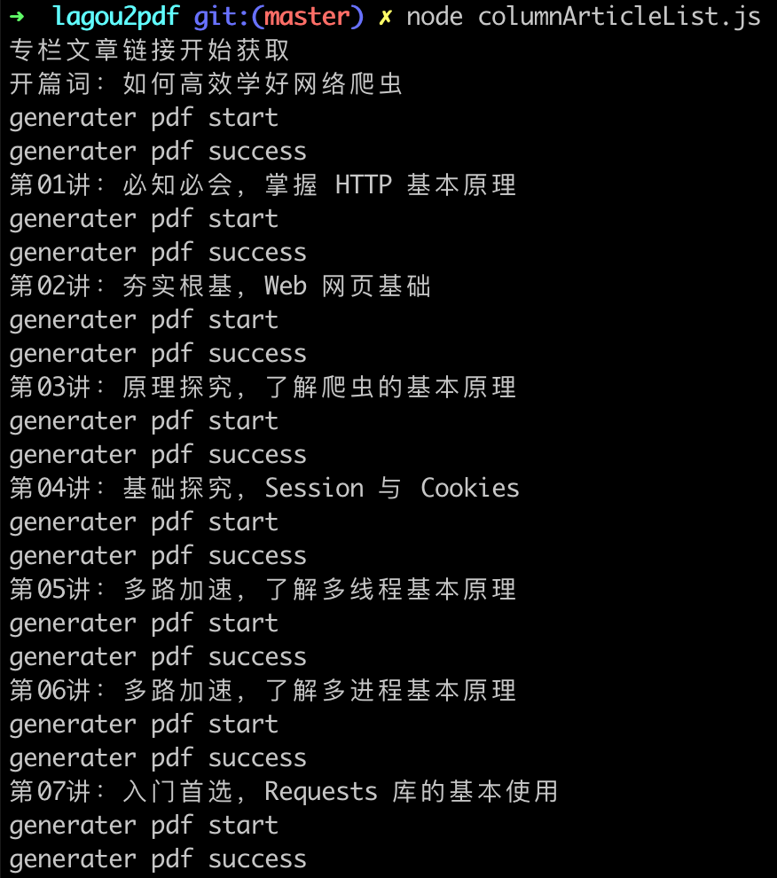
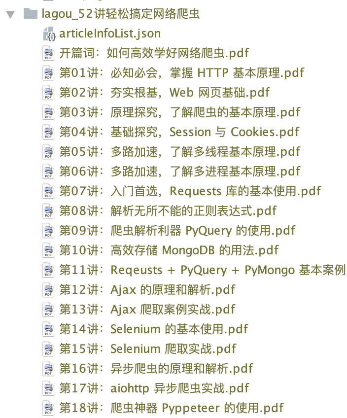
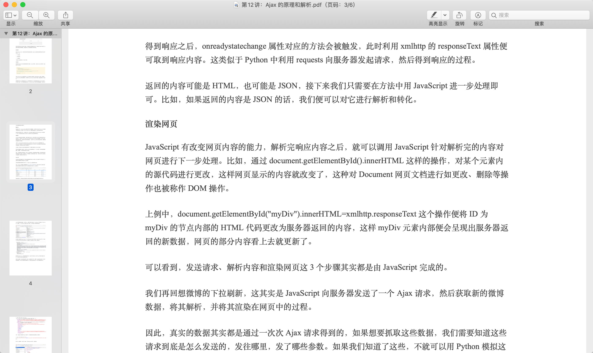

# 拉钩教育专栏文章 转为 PDF

> 说明：该项目仅仅只能用户个人学习使用，不能在商业中使用，若极客时间官方要求该代码仓库删除，请联系我进行删除

> 本项目代码完全由 [jjeejj/geektime2pdf](https://github.com/jjeejj/geektime2pdf) 修改而来，特此感谢。

## 使用方法

### 配置信息

在配置文件 [config.js](./config.js) 中修改配置所需要的信息

```js
/**
 * 需要转换为 pdf 的配置信息 
 */
module.exports = {
    url: 'https://gate.lagou.com/v1/neirong/kaiwu/getCourseLessonDetail',  // 该配置项不需要改动
    columnName: '52讲轻松搞定网络爬虫',  // 专栏名称
    firstArticalId: 1661, // 专栏第一篇文章的 ID
    lastArticalId: 1680, // 专栏最后一篇文章的 ID
    cookie: 'cookie'
};
```

* 上面的配置项**第一项是不需要修改**的, 只需要修改后面的专栏信息

* 会自动生成一个`lagou_{{columnName}}` 的文件夹来保存导出的所有`pdf`文件, `columnName` 为上面配置的

* `firstArticalId` 这个参数最好配置专栏第一篇文章的 `ID` ，这个可以获取专栏的所有的文章,若不是第一篇文章的`ID` 则获取的是该文章以及之后的文章

* `cookie` 你在网页版登录后返回的`cookie`信息

### 运行

1. `git clone https://github.com/lichangao1826/lagou2pdf.git` 在本地克隆下来
2. 然后执行 `npm i` 安装依赖
3. 运行主程序 `node columnArticleList.js` 等待一段时间,生成 `PDF` 完成



## 导出结果



